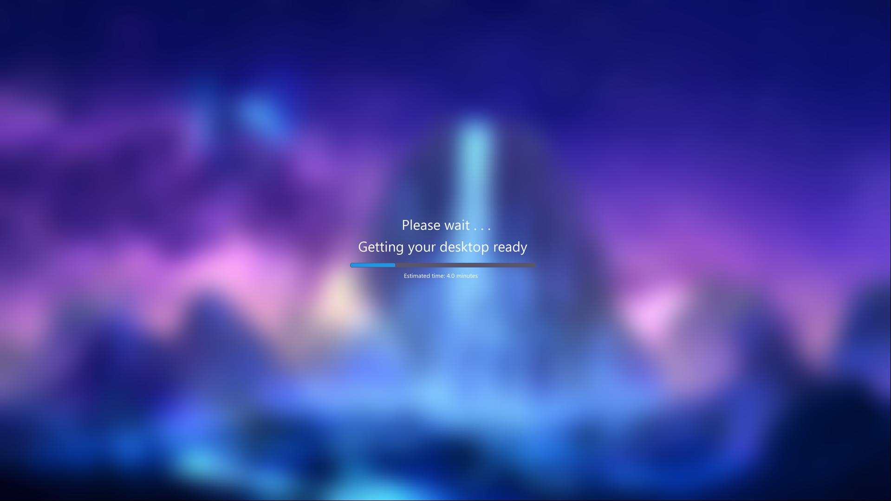

<div align="center">
<h1>Extra Splash Screen</h1>
</div>

###  Purpose of the Project

Many Windows users have numerous startup applications, background services, cloud synchronization tools, and other programs that launch immediately after logging in. On slower systems, or systems with a large number of startup applications, the desktop may appear before Windows has finished loading everything in the background.

This often results in an experience where the desktop becomes visible but is not yet fully responsive. Applications may still be launching, icons may still be loading, and overall system performance can feel sluggish for the first few minutes after logon.

This project was created to solve that problem.

Instead of immediately exposing the desktop, the script displays a Windows-style splash screen for a configurable amount of time while Windows continues loading startup applications and services in the background. By the time the splash screen disappears, the desktop is typically much closer to a fully usable state.

The goal is not to make Windows boot faster, but rather to provide a cleaner and more polished logon experience for users who prefer waiting a few extra minutes in exchange for a desktop that is ready to use when it appears.

This project was originally developed for exactly that reason: to avoid interacting with a partially loaded desktop and instead wait until Windows had enough time to finish loading startup applications and background processes.

---

### What it is?

Windows Logon Splash Screen is a Python-based Windows customization utility that replaces the default desktop loading experience with a full-screen splash screen displayed immediately after user logon.

The application displays a custom blurred background image, animated progress bar, countdown timer, and completion screen while Windows continues loading the desktop environment in the background.

The project was designed to simulate a polished operating system startup experience similar to modern enterprise deployment environments, OEM preload systems, kiosk systems, and custom workstation setups.

Users can customize the splash screen duration, background image, and deployment configuration to create a logon experience that better matches their workflow and system performance requirements.

---

## 🖼️ Preview

### Loading Screen



### Small Timer At top-left corner


### Completion Screen


---

## 🖥️ Platform Compatibility

This project is designed exclusively for **Microsoft Windows**.

The main purpose of this script is to provide a better logon experience on Windows systems that require additional time to load startup applications, background services, cloud synchronization tools, and other processes after login.

### Supported Platforms

✔ Windows 10
✔ Windows 11

### Unsupported Platforms

✖ Linux
✖ macOS
✖ ChromeOS
✖ BSD-based operating systems

### Why Windows Only?

This project relies on Windows-specific components such as:

* Windows Registry (`Winlogon`)
* `userinit.exe`
* Windows startup and logon mechanisms
* Windows system directories (`C:\Windows\System32`)
* Windows API calls through `ctypes`

Because of these dependencies, the project is not supported on non-Windows operating systems and is not expected to function correctly outside of Windows.

---

## ✨ Features 
* Full-screen splash screen displayed after Windows logon
* Custom background image support
* Automatic Gaussian blur effect generation
* Dynamic "Please wait..." loading screen
* Animated indeterminate progress bar
* Countdown timer display * Final "Almost done..." completion screen
* Runs before Windows Explorer becomes visible
* Automatically launches Windows user initialization process
* Dark mode aware progress bar styling
* Configurable display duration through a single variable
* Packaged as a standalone executable using PyInstaller

---

## 🛠️ Technologies Used

* Python
* Tkinter
* CustomTkinter
* Pillow (PIL)
* Psutil
* Pynput
* DarkDetect
* PyInstaller

---

## ⚠️ Important WARNING

**Read this section carefully before installing.**

This project intentionally restricts user interaction with the desktop while the splash screen is active.

### Keyboard Locking

During execution the script:

* Disables keyboard input using `pynput`
* Prevents interaction with the desktop
* Forces the splash screen to remain on top of all windows
* Grabs focus globally
* Prevents normal desktop usage until the configured timer expires

Because of how Windows handles secure system shortcuts:

* **Ctrl + Alt + Delete** remains available because it is handled by Windows at the system level
* Other standard keyboard input is blocked while the splash screen is active

### Always-On-Top Behavior

The application continuously forces itself to remain above other windows.

Once started:

* The splash screen cannot be normally minimized
* The splash screen cannot be closed through standard methods
* Desktop interaction remains blocked until the configured duration finishes

### Install At Your Own Risk

Although the application was developed with safeguards to avoid permanently locking the desktop, modifying the Windows logon process always carries risk.

Potential issues include:

* Incorrect registry configuration
* Missing resource files
* Invalid executable paths
* Improper installation
* Misconfigured splash screen duration

Always test the project thoroughly before deploying it on a production machine.

It is strongly recommended to keep a backup of your system or create a restore point before installation.

> [!CAUTION]
> By using this project, you acknowledge that you understand the risks involved with modifying the Windows logon process. While the application includes safeguards and a dedicated TEST_MODE for safer testing, the author cannot guarantee compatibility with every system configuration.
>
> You are solely responsible for any changes made to your system, including registry modifications, startup configuration changes, or deployment mistakes. I shall not be held responsible for any data loss, boot issues, system instability, desktop lockouts, configuration errors, or other problems that may arise from the use, misuse, modification, or improper installation of this software.
>
> You have been warned. Proceed only if you understand the installation process and are comfortable making changes to your Windows system.

---

## 📋 Requirements

Before using this project, users should have:

* Users should first estimate how long their system typically takes to finish loading startup applications, background services, cloud synchronization tools, and other programs after logging into Windows. This estimated duration should then be used when configuring the `actualTime` (Default value is 4.0) variable inside `main.pyw`. Choosing a value that is too low may result in the splash screen disappearing before the desktop is fully ready, while choosing a value that is too high may cause unnecessary waiting after the system has already finished loading.
* Basic knowledge of Python
* Basic understanding of Windows Registry
* Basic understanding of the Windows logon process
* Administrator privileges
* Python installed globally on the system

---

## 📂 Project Structure

```text id="44f71q"
Extra-Splash-Screen/
│
├── assets/
│   ├── loading-screen.png
│   ├── completion-screen.png
│   └── long-press.png
│
├── README.md
├── LICENSE
├── requirements.txt
├── main.pyw
├── image.jpg
└── Segoe.woff
```

### File Description

| File / Folder                  | Purpose                                                                                      |
| ------------------------------ | ---------------------------------------------------------------------------------------------|
| `assets/loading-screen.png`    | Preview image of the main splash screen                                                      |
| `assets/completion-screen.png` | Preview image of the completion screen                                                       |
| `assets/long-press.png`        | Preview image of timer at top-left corner of the screen on long press mouse button           |
| `main.pyw`                     | Main application source code responsible for the splash screen and Windows logon integration |
| `image.jpg`                    | Custom background image displayed during the splash screen                                   |
| `Segoe.woff`                   | Font file used by the splash screen text renderer                                            |
| `requirements.txt`             | Python package dependencies required to build and run the project                            |
| `LICENSE`                      | Project license information                                                                  |
| `README.md`                    | Project documentation and installation guide                                                 |

---

## 🚀 Installation Guide

Follow the steps below carefully to install and configure the splash screen correctly.

### Step 1 — Download the Project

Either clone the repository:

```bash
git clone https://github.com/dslord/Extra-Splash-Screen.git
cd Extra-Splash-Screen
```

Or download the ZIP archive directly from GitHub and extract it to a folder of your choice.

---

### Step 2 — Install Required Dependencies

Before building the executable, install all required Python packages globally.

```bash
pip install -r requirements.txt
```

Make sure all dependencies are installed successfully before proceeding.

---

### Step 3 — Configure Splash Screen Duration

Open the `main.pyw` file using:

* Visual Studio Code
* Notepad++
* Sublime Text
* Any text editor of your choice

Locate the following line:
NOTE: The values are in minutes only.

```python
actualTime = 4.0
```

This value controls how long the splash screen remains visible after Windows logon.

Examples:

```python
actualTime = 2.0
```

Displays the splash screen for 2 minutes.

```python
actualTime = 5.5
```

Displays the splash screen for 5 minutes and 30 seconds.

```python
actualTime = 10.0
```

Displays the splash screen for 10 minutes.

Save the file after making your changes.

---

### Step 4 — Choose a Custom Background

The application uses an image named:

```text
image.jpg
```

as the fullscreen background.

You may replace it with any image of your choice:

* Personal wallpaper
* Company branding
* Gaming setup background
* Deployment screen
* Maintenance screen
* Any high-resolution image

Simply rename your chosen image to:

```text
image.jpg
```

and replace the existing file inside the project folder.

For the best results, use an image that matches your monitor resolution.

---

### Step 5 — Build the Executable

Open Command Prompt inside the project folder and run:

```bash
pyinstaller --noconfirm --noconsole --onefile --hide-console="hide-early" --hidden-import=tkinter main.pyw
```

PyInstaller will generate a new folder named:

```text
dist
```

Inside this folder you will find the final executable.

---

### Step 6 — Copy Required Resource Files

Move the following files to:

```text
C:\Windows\System32\
```

Required files:

```text
image.jpg
Segoe.woff
```

The application loads these resources during Windows logon, therefore they must remain accessible at all times.

---

### Step 7 — Configure Windows Logon

Open Registry Editor:

```text
Win + R
```

Type:

```text
regedit
```

Navigate to:

```text
HKEY_LOCAL_MACHINE
 └── SOFTWARE
     └── Microsoft
         └── Windows NT
             └── CurrentVersion
                 └── Winlogon
```

Locate the appropriate startup value used by your Windows installation and modify it so that it points to your generated executable.

Example:

```text
C:\CustomSplash\dist\main.exe
```

Double-check the path before saving.

An incorrect registry path can prevent the splash screen from launching correctly during logon.

---

### Step 8 — Reboot and Test

Restart Windows.

If everything was configured correctly:

1. Windows logon will start normally.
2. The splash screen will appear.
3. Windows initialization will continue in the background.
4. The countdown timer and progress bar will be displayed.
5. The splash screen will automatically close when the configured duration ends.
6. The desktop will become fully accessible.

---

## ⏳ Changing the Duration Later

If you want to change the splash screen duration after installation:

1. Open `main.pyw`
2. Edit the `actualTime` variable
3. Save the file
4. Rebuild the executable using the PyInstaller command
5. Replace the previously installed executable

The executable must be rebuilt every time the duration is changed because the value is compiled directly into the application.

## 🔧 For Developers/Contributors

For developers, contributors, and cautious users, the script includes a built-in testing mode.

By default:

```python
TEST_MODE = False
```

The application runs in its intended production configuration where keyboard input is blocked and the splash screen remains locked on top of the desktop.

---

### Enabling TEST_MODE

Before building the executable, open:

```python
main.pyw
```

Locate:

```python
TEST_MODE = False
```

and change it to:

```python
TEST_MODE = True
```

Then rebuild the executable using the normal PyInstaller command.

---

### What TEST_MODE Changes

When TEST_MODE is enabled:

* Keyboard input is NOT blocked
* Global keyboard suppression is disabled
* Desktop interaction remains available
* Touchpad gestures can be used normally
* Windows multitasking gestures continue working
* The splash screen can be minimized through normal window management methods

---

### Emergency Exit Key

TEST_MODE also enables an emergency escape mechanism.

If something behaves unexpectedly while testing, press:

```text
ESC
```

to immediately exit the splash screen.

This feature exists specifically to help developers safely test modifications without risking being locked out of the desktop.

---

### Recommended For Developers

If you plan to:

* Modify the source code
* Change splash screen behavior
* Adjust timing logic
* Experiment with Windows logon integration
* Contribute to the project

it is highly recommended to perform all testing with:

```python
TEST_MODE = True
```

and only switch back to:

```python
TEST_MODE = False
```

once you are confident that everything is functioning correctly.

This significantly reduces the risk of accidental desktop lockouts during development and debugging.


---

## 🧠 How It Works

When Windows boots:

1. User logs into Windows.
2. Splash executable launches.
3. Keyboard input is blocked.
4. Custom background image is displayed.
5. Progress bar animation begins.
6. Countdown timer starts.
7. Windows initialization continues in the background.
8. Completion screen appears.
9. Keyboard input is restored.
10. Splash screen exits.
11. Desktop becomes fully accessible.

---

## 🎯 Ideal Use Cases

This project may be useful for:

* Systems with many startup applications
* Older laptops and desktops
* Workstations with heavy background software
* Custom Windows deployments
* Kiosk environments
* Users who prefer waiting for a fully loaded desktop

---

## 📝 Notes

* Tested primarily on Windows systems.
* Administrator privileges may be required.
* Incorrect registry modifications can cause system startup issues.
* Resource files must remain accessible.
* Always verify paths before modifying Windows logon settings.
* Use on personal systems only unless fully tested.

---

## 🤝 Contributing

Contributions are welcome. Feel free to fork the repository, improve the codebase, and submit a pull request.

---

## 📄 License

This project is provided for educational and customization purposes. Users assume all responsibility for installation, configuration, and system modifications performed while using this software.

---

✨ Developed by **dslord**.
